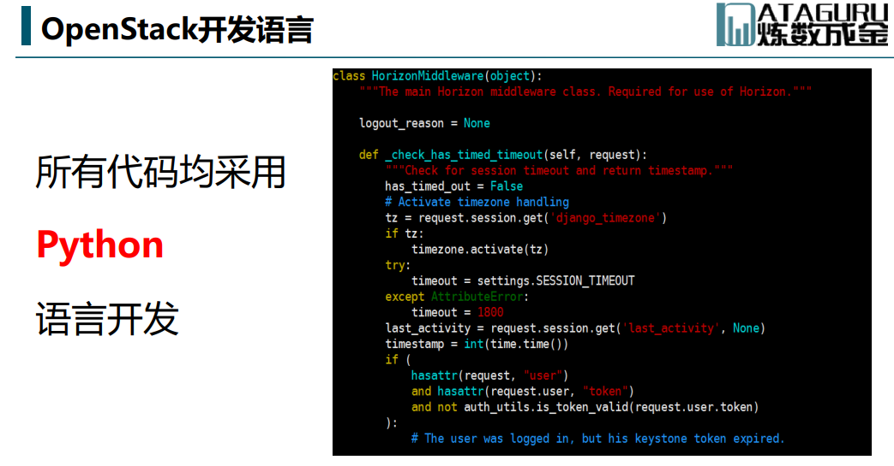

# 第一课

## OpenStack介绍

* 虚拟化

* 云计算

**业务模式**，取用方便，商品流通

* 云计算三种类型

私人云 - 内部使用

公有云 - 付费用户使用

混合云 - 公私混合

* 云计算三种模式

官方定义，云操作系统。管理数据中心资源。

1. 亚马逊云计算的山寨版本；
2. 开放、开源软件组合而成的集合；1+1>2
3. OpenStack是集成框架，不能直接满足业务需求，需要做定性开发；
4. 扩展性强，借助第三方；

## OpenStack项目介绍

* Nova
* Neutron
* Cinder
* Swift
* Glance
* Keystone
* Horizon

## 各个组件之间的关系

目前OpenStack基础服务组件如下:

Keystone：认证服务。
Glance：镜像服务。
Nova：计算服务。
Cinder：块存储服务。
Neutorn：网络服务。
Swift：对象存储服务。

## OpenStack开源社区现状、动态和未来方向

## OpenStack项目整体基本架构及演进

* 字母开头，ABCDEF

## OpenStack开发语言

* 使用python胶水语言

## OpenStack架构

* 组件之间通过Api交互，消息队列交互

## OpenStack架构职责演变

高内聚，低耦合

## OpenStack架构设计特点

* 分布式，集群支持
* 异步执行，消息队列

## 基于OpenStack实现的成功案例介绍

## OpenStack和CloudStack、Docker对比

---
