# 第二课

## 计算虚拟化相关技术介绍

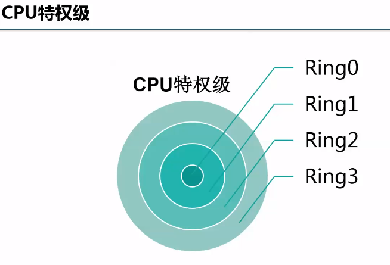

CPU特权级，Linux只用到了0和3特权级

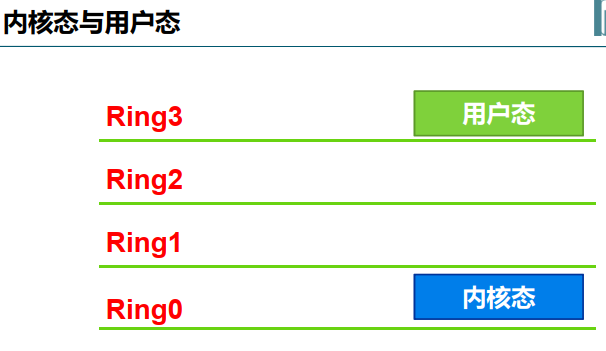

完全虚拟化，客户机操作系统感知不到宿主机存在

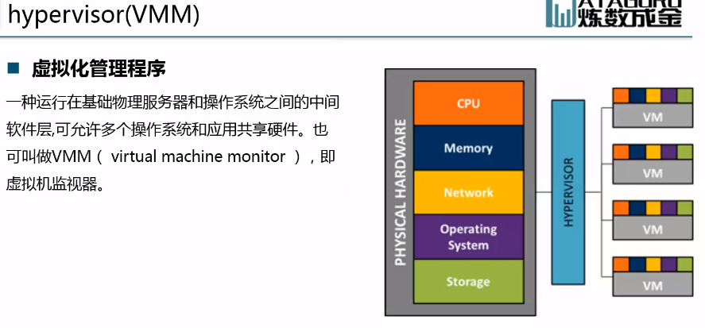

虚拟化管理程序，虚拟机监视器

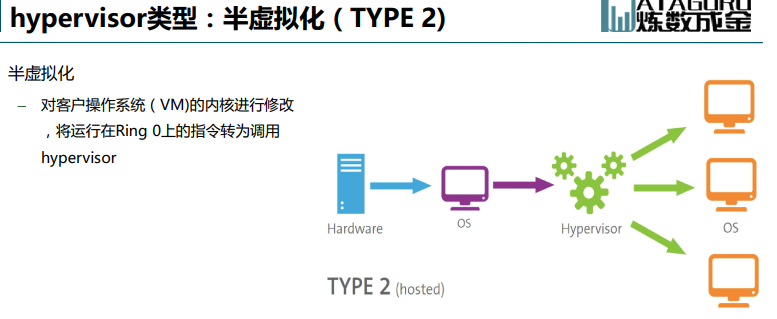

客户机知道自己运行在虚拟机


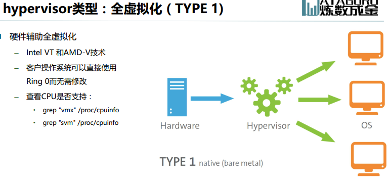

完全虚拟化，客户机感知不到自己处于虚拟化状态

VMware 非硬件辅助虚拟化，软件模拟


轻量级虚拟化 - 操作系统虚拟化

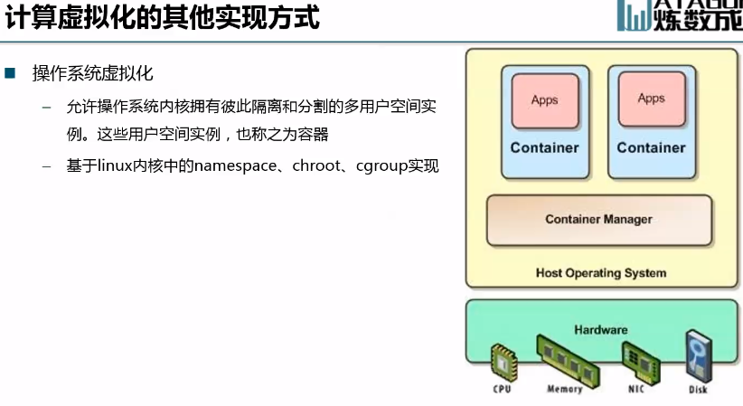


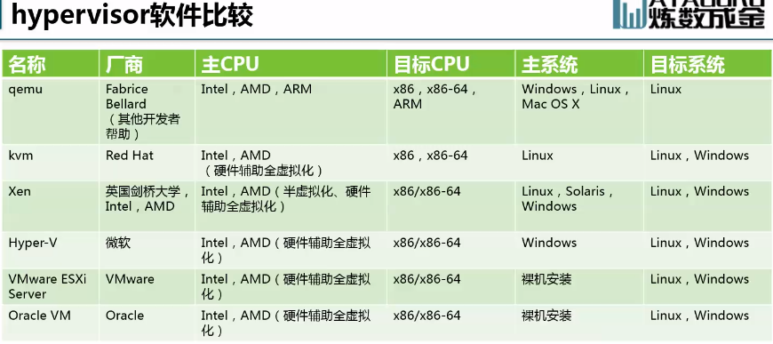

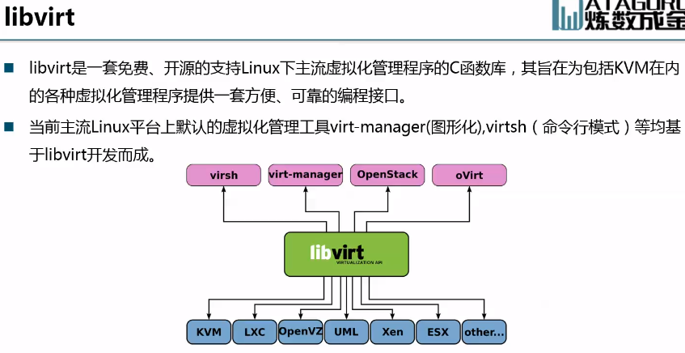

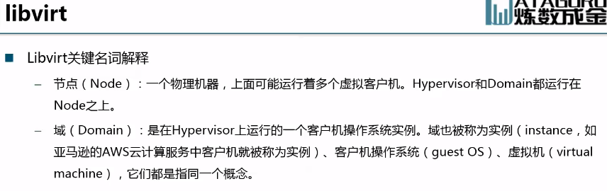


## 网络虚拟化相关技术介绍

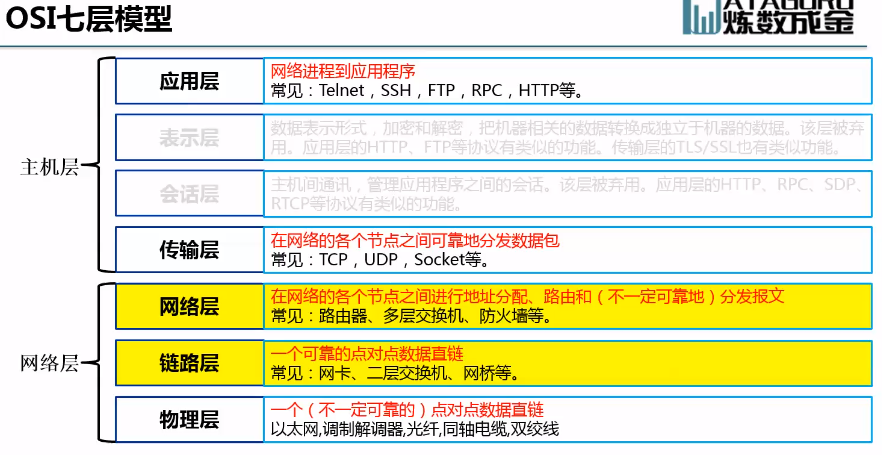

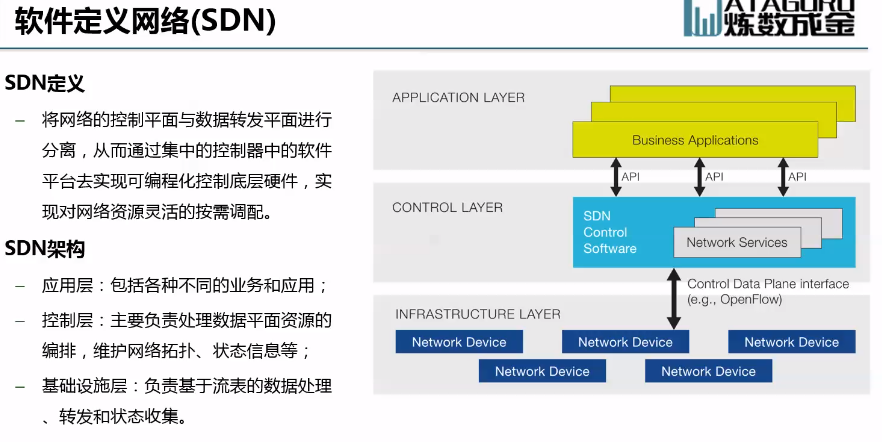

控制平面和网络平面分离，控制平面是核心

OVS 二层虚拟交换机

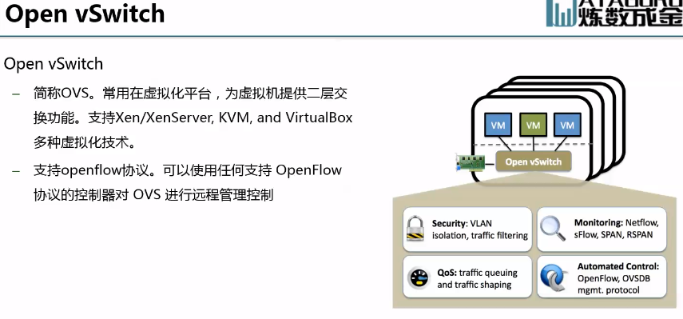

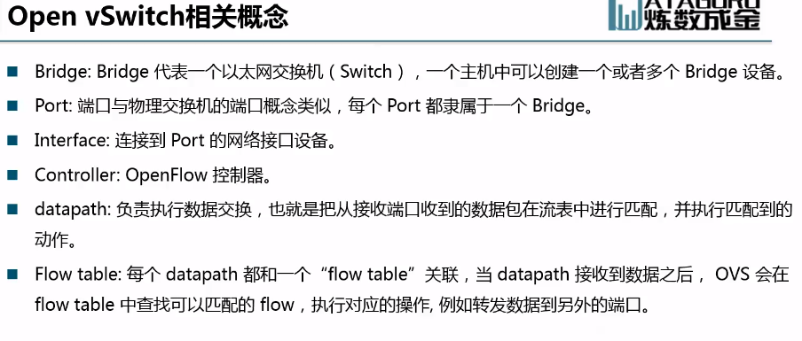

OVS依赖于内核模块

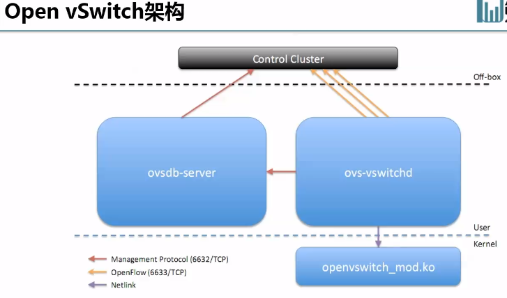

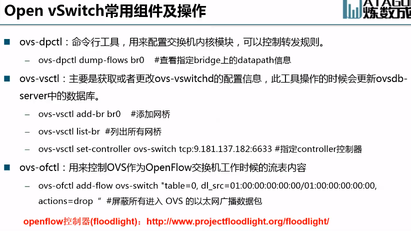

Linux内置虚拟网桥，内核提供，极少使用，功能简单。

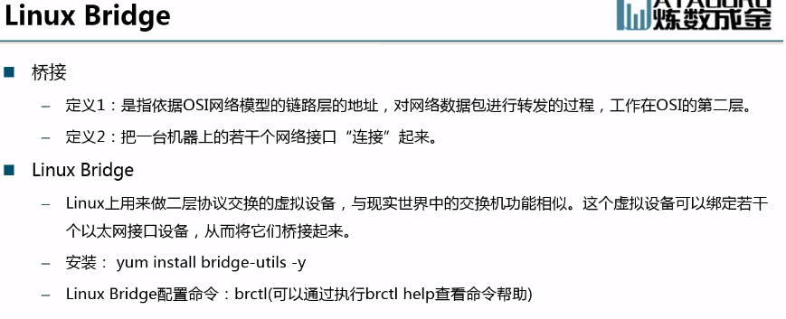


## OpenStack通用组件介绍

**Liberty才开始支持Python3**

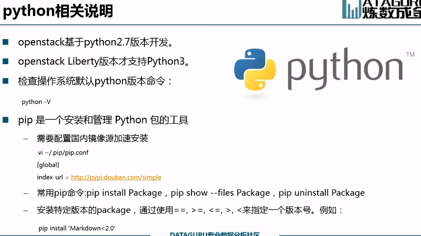


```
pip show --files PACKAGES
```

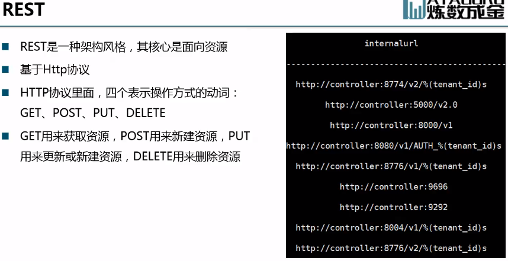

* GET、POST、PUT、DELETE
* 基于HTTP协议，可以不需要代理客户端就可以直接访问


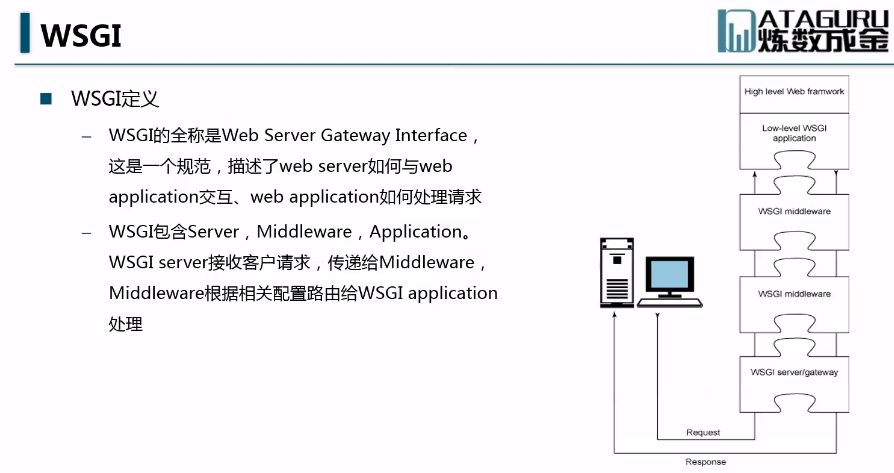

wsgi ？

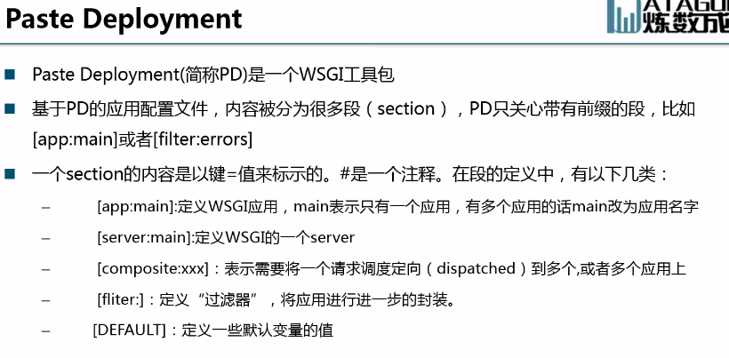


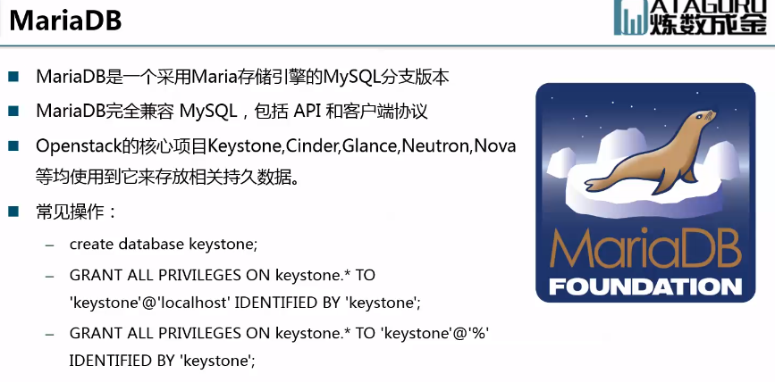

openstack默认用mysql

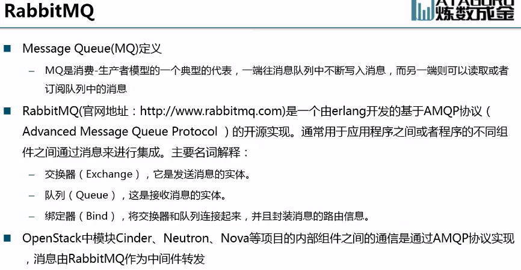

异步处理机制


---
