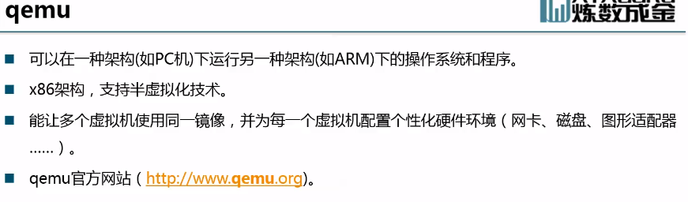
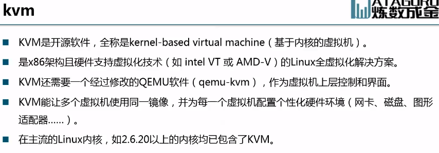

# 第二课

## 计算虚拟化相关技术介绍

CPU特权级，Linux只用到了0和3特权级

完全虚拟化，客户机操作系统感知不到宿主机存在

虚拟化管理程序，虚拟机监视器

客户机知道自己运行在虚拟机

完全虚拟化，客户机感知不到自己处于虚拟化状态

VMware 非硬件辅助虚拟化，软件模拟

轻量级虚拟化 - 操作系统虚拟化

## 网络虚拟化相关技术介绍

控制平面和网络平面分离，控制平面是核心

## OpenStack通用组件介绍

---
