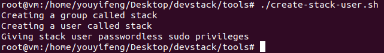
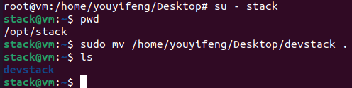
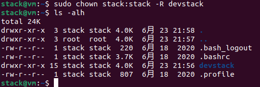

# 第四课

## devstack安装

使用Ubuntu 20.10

安装好系统，修改软件源

```
sudo apt-get install -y build-essential git openssh-server vim
```

克隆devstack仓库

```
git clone http://git.openstack.org/openstack-dev/devstack.git
```

创建stack用户




切换用户，并将devstack仓库移到该用户家目录下



```
sudo chown stack:stack -R devstack
```



下载openstack源代码

```
git clone https://opendev.org/openstack/horizon.git /opt/stack/horizon
git clone https://opendev.org/openstack/keystone.git /opt/stack/keystone
git clone https://opendev.org/openstack/nova.git /opt/stack/nova
git clone https://opendev.org/openstack/neutron.git /opt/stack/neutron
git clone https://opendev.org/openstack/glance.git /opt/stack/glance
git clone https://opendev.org/openstack/cinder.git /opt/stack/cinder

```


---
